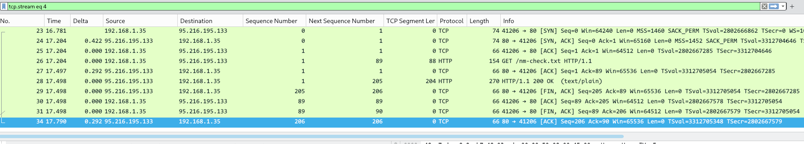

# Lab Report: TCP Handshake & Latency Analysis

**Date:** Feb 03, 2026
**Lab :** Asus G14 (Arch Linux)
**Tool:** Wireshark

---

### 📸 Evidence (Capture Screenshot)
Here is the capture from my lab session showing the high delay:

---

### 📝 My Observations

**1. Finding the Slowness (Latency)**
I noticed that the connection took a long time to establish.
* **Packet 23 (My SYN):** Sent at time 16.781.
* **Packet 24 (Server SYN-ACK):** Received at time 17.204.
* **The Delta:** There is a **422ms delay** (0.422s) just in the handshake.
* *Conclusion:* This proves the slowness is due to Network RTT (Distance), not the application processing.

**2. Doing the Math (Sequence Check)**
I manually checked if any data was lost during the transfer.
* In **Packet 26**, I sent 88 bytes with `Seq=1`.
* Math: `1 (Current Seq) + 88 (Length) = 89`.
* In **Packet 27**, the Server correctly replied with `Ack=89`.
* *Verdict:* The TCP math matches perfectly. No packet loss occurred.

**3. Connection Close**
The server sent the `FIN` flag first (Packet 29). This is normal behavior for this type of HTTP check—the server sends the file and hangs up immediately.
