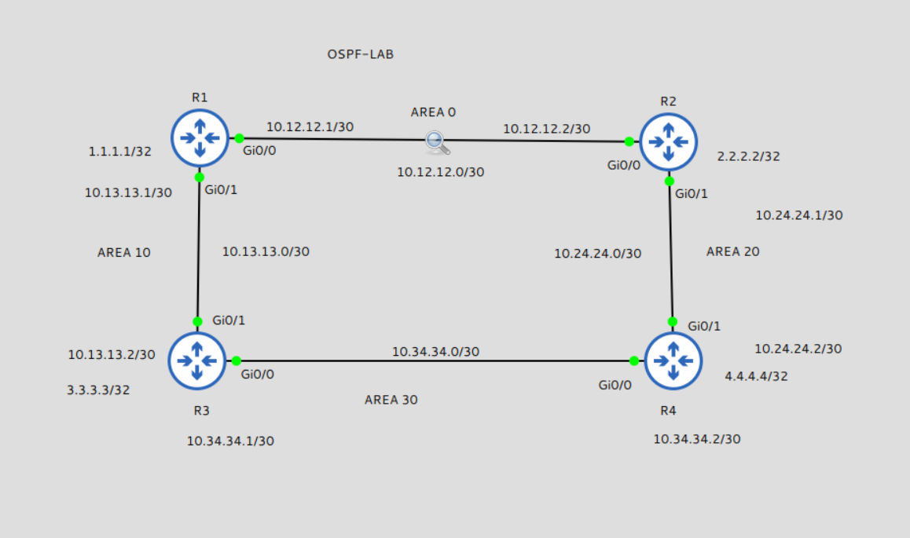
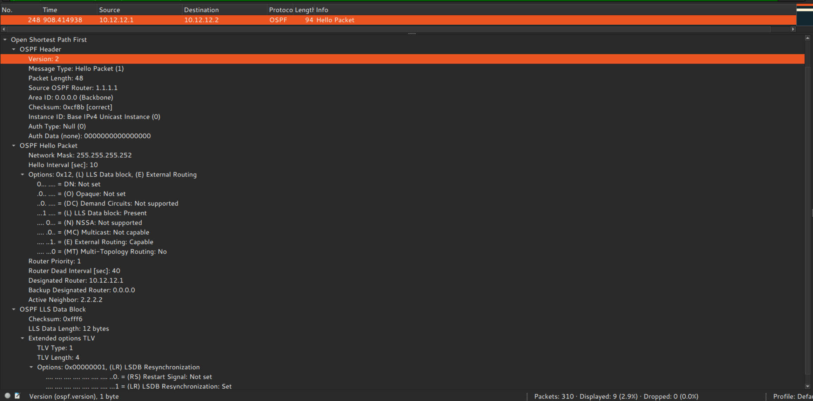
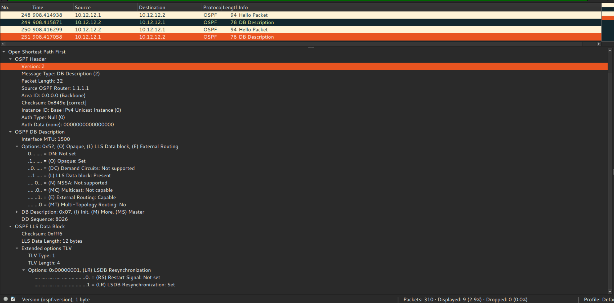
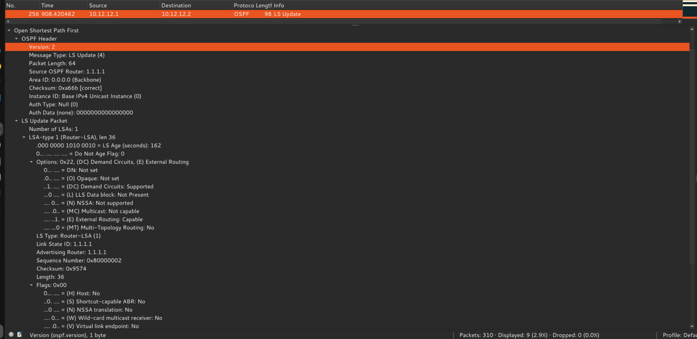
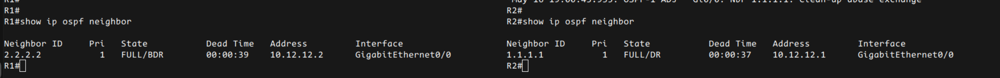

# OSPF Neighbor Formation

## Objective

Understand how OSPF neighbors form adjacency using:
- Hello packets
- DBD exchange
- LS Requests
- LS Updates
- Wireshark packet analysis
- OSPF debug logs

---

## Topology



---

## OSPF Neighbor States

| State | Purpose | Packet Seen |
|---|---|---|
| Down | No communication | None |
| Init | Hello received | Hello |
| 2-Way | Bidirectional communication | Hello |
| EXSTART | Master/slave negotiation | DBD |
| EXCHANGE | LSDB summary exchange | DBD |
| LOADING | Missing LSAs requested | LSR / LSU |
| FULL | LSDB synchronized | Hello |

---

## Hello Packet



Observed:
- Neighbor discovery
- Hello and dead timers
- Area verification
- Router ID exchange

---

## DBD Packet



Observed:
- Database summary exchange
- Master/slave negotiation
- LSDB synchronization start
- MTU verification phase

---

## LSU Packet



Observed:
- Router sends actual LSAs
- Topology information shared
- Link-state database synchronization

---

## FULL Adjacency



Observed:
- OSPF adjacency reached FULL state
- LSDB synchronized successfully
- Routing information exchanged correctly

---

## Important Learning

- Hello packets discover neighbors.
- DBD packets exchange LSDB summaries.
- MTU is checked during DBD exchange.
- LSR packets request missing LSAs.
- LSU packets transfer actual LSAs.
- FULL state means LSDB synchronization completed successfully.

---

## Verification Commands

```bash
show ip ospf neighbor
show ip ospf database
show ip route ospf
debug ip ospf adj
