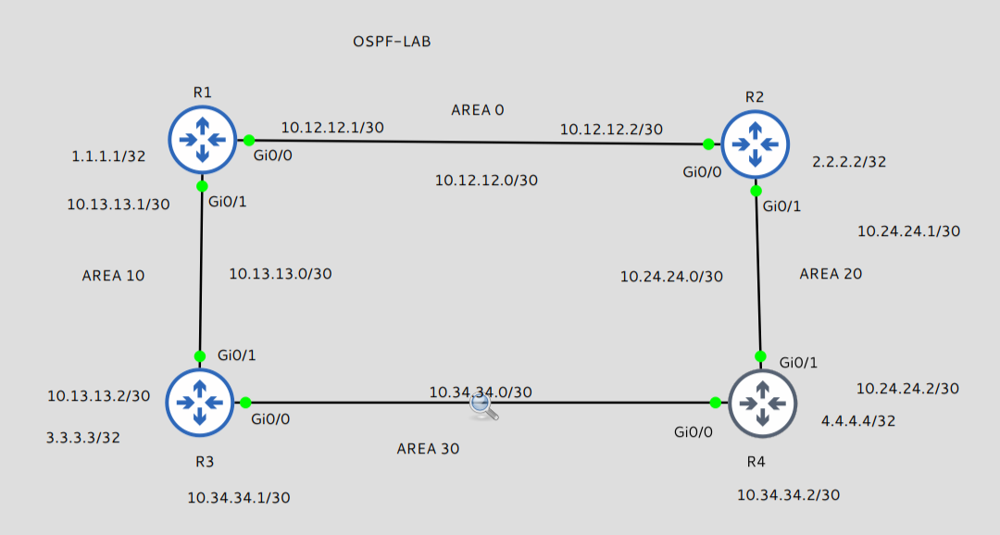
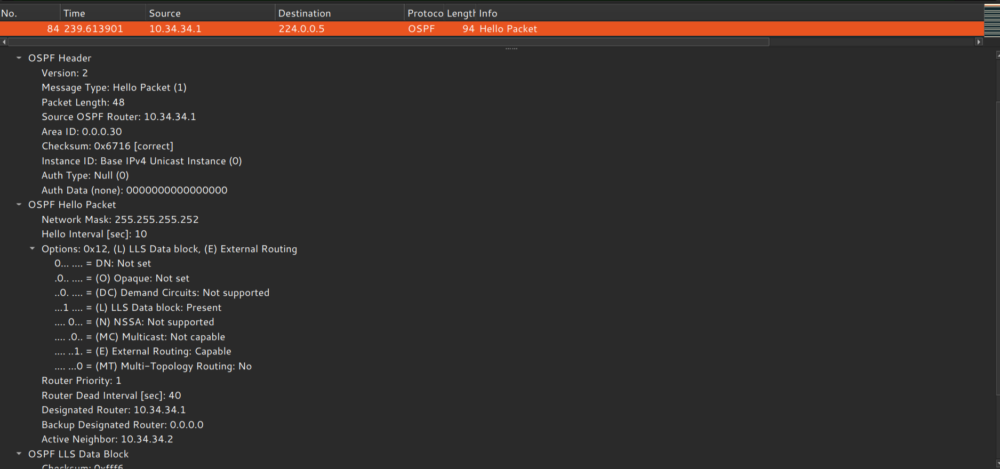
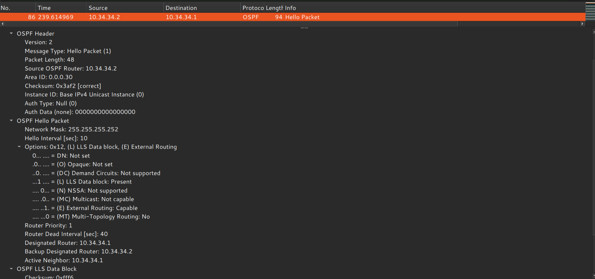
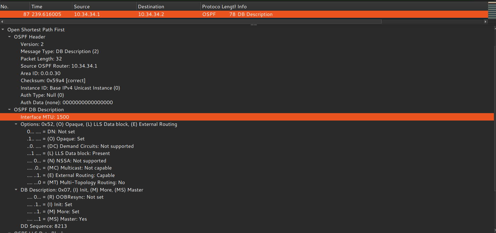
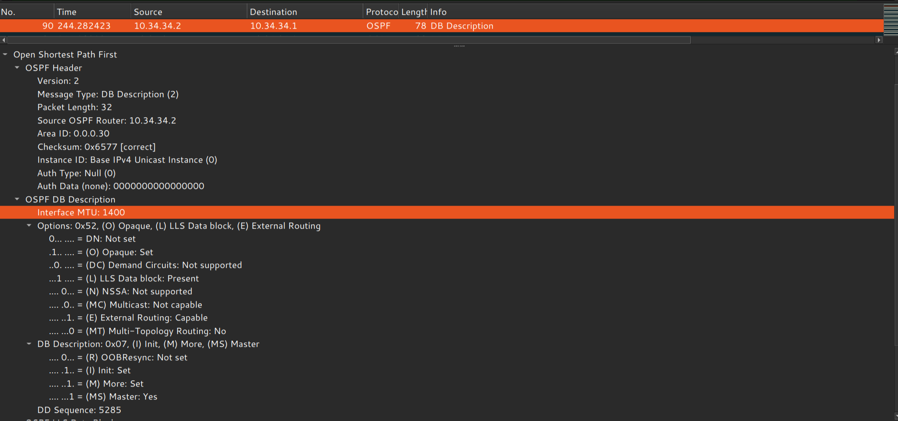
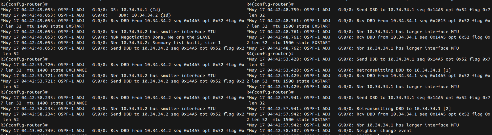
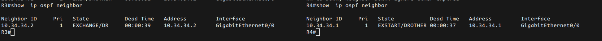

# OSPF MTU Mismatch Lab

## Objective

This lab demonstrates how OSPF neighbor adjacency fails because of an MTU mismatch during the Database Description (DBD) exchange phase.

The objective of this lab was to analyze:

- OSPF Hello packet exchange
- DR/BDR election
- DBD packet negotiation
- Master/Slave selection
- Neighbor state transitions
- MTU mismatch behavior
- DBD retransmissions
- OSPF adjacency troubleshooting

---

# Lab Topology



---

# Problem Scenario

OSPF adjacency between R3 and R4 failed to reach FULL state.

Observed neighbor states:

- EXSTART
- EXCHANGE

The routers continuously retransmitted DBD packets and eventually the adjacency moved DOWN because of excessive retransmissions.

---

# OSPF Hello Packet Analysis

## R3 Hello Packet



## R4 Hello Packet



### Key Observations

- Area ID matched
- Hello and Dead timers matched
- Neighbor discovery successful
- DR/BDR election completed
- Hello packets exchanged successfully

---

# DBD Packet Analysis

## R3 DBD Packet



## R4 DBD Packet



### Key Observations

- R3 advertised MTU 1500
- R4 advertised MTU 1400
- MTU mismatch detected during DBD exchange
- Master/Slave negotiation observed
- OSPF adjacency failed before FULL state

---

# OSPF Debug Analysis

## MTU Mismatch Debug



### Debug Observations

- DBD retransmissions observed
- Neighbor MTU mismatch detected
- Adjacency repeatedly attempted synchronization
- Excessive retransmissions caused neighbor DOWN event

---

# Neighbor State Verification



### Observed States

R3:
- EXCHANGE/DR

R4:
- EXSTART/BDR

This confirmed incomplete LSDB synchronization.

---

# Device Configuration


---

# Root Cause Analysis

The OSPF adjacency failed because the interface MTU values did not match.

- R3 MTU = 1500
- R4 MTU = 1400

OSPF validates MTU values during the DBD exchange phase.

Because the MTU values differed, LSDB synchronization failed and the neighbor relationship never reached FULL state.

---

# Resolution

The issue can be resolved by matching MTU values on both routers.

Example:

```cisco
interface GigabitEthernet0/0
 mtu 1500
```

Alternative workaround:

```cisco
ip ospf mtu-ignore
```

The preferred solution is matching interface MTU values instead of ignoring MTU validation.

---

# Key Learning Outcomes

- OSPF Hello packets do not validate MTU
- MTU validation occurs during DBD exchange
- DBD packets are responsible for LSDB synchronization
- OSPF neighbor formation is state-machine driven
- MTU mismatches commonly cause EXSTART/EXCHANGE issues
- OSPF retransmits DBD packets during synchronization failures
- Debug commands are critical for troubleshooting adjacency issues

---

# Commands Used

```cisco
show ip ospf neighbor
show ip ospf neighbor detail
show ip ospf interface
debug ip ospf adj
```
