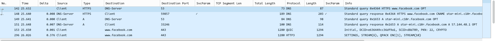
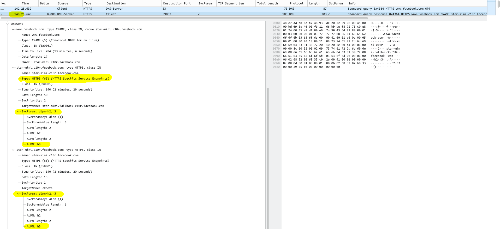
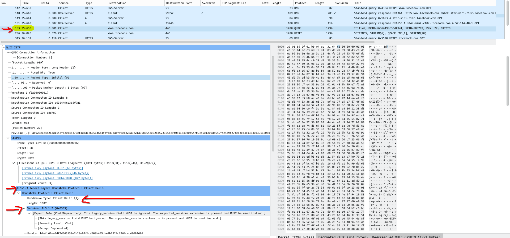
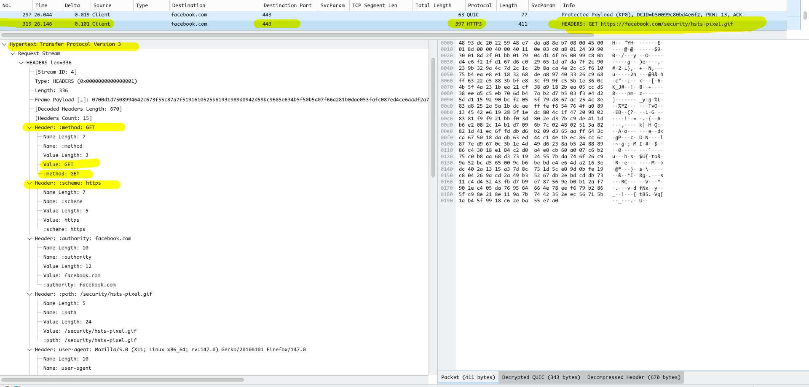

# 🚀 Deep Dive: QUIC & HTTP/3 Protocol Analysis
**Project:** Wireshark Analysis of UDP-based Web Traffic
**Protocol:** QUIC (Quick UDP Internet Connections)
**Target:** Facebook.com

## 📖 Introduction: What is QUIC?
QUIC (Quick UDP Internet Connections) is a modern transport layer network protocol designed to improve the performance of web applications. Unlike standard HTTP which stacks multiple protocols (HTTP over TLS over TCP), **QUIC merges Transport (UDP), Security (TLS 1.3), and Reliability into a single layer.**

This case study demonstrates how QUIC bypasses the traditional "TCP Head-of-Line Blocking" issue by using UDP while maintaining the security of TLS 1.3.

---

## 🔬 Wireshark Analysis Findings

### 1. The Timeline (Zero-RTT Connection)

* **Observation:** The capture shows a DNS query followed immediately by a QUIC packet.
* **Significance:** There is **no TCP 3-Way Handshake**. The connection establishment latency is drastically reduced (Zero-RTT), as the handshake and encryption keys are exchanged in the very first packet.

### 2. DNS Negotiation (The Permission)

* **Mechanism:** The browser asks via DNS (Type 65 HTTPS Record) if the server supports QUIC.
* **Result:** The DNS server responds with `alpn="h3"`. This "Application-Layer Protocol Negotiation" confirms that the client can skip TCP and use UDP port 443 directly.

### 3. Connection & Security (Merged Layers)

* **The Difference:** In TCP, the "Connection" (SYN/ACK) and "Security" (TLS Hello) happen in separate round-trips.
* **In QUIC:** The **QUIC Initial** packet contains the TLS 1.3 Client Hello.
* **Impact:** This makes QUIC "Connection-Oriented" despite running on UDP (which is connectionless). It uses **Connection IDs (CIDs)** to track the session, allowing users to switch networks (WiFi to 5G) without breaking the download.

### 4. Decrypting the Payload

* **Encryption:** QUIC payloads are encrypted by default. Without the `SSLKEYLOGFILE`, Wireshark only shows "Protected Payload".
* **Decryption:** By injecting the session keys, I revealed the HTTP/3 `GET` request. This confirms that the application layer (HTTP) is successfully running over the QUIC transport.

---

## 🧠 Technical Insight: Handling MTU & MSS
One of the biggest challenges in UDP is fragmentation. In TCP, the **MSS (Maximum Segment Size)** option in the SYN packet prevents fragmentation.

**How QUIC handles this (My Observation):**
* **No MSS Option:** QUIC headers do not have an MSS field like TCP.
* **Path MTU Discovery (PMTUD):** Instead of trusting the router to clamp the MSS, QUIC actively probes the network path.
* **Padding:** I observed that the **QUIC Initial** packets are heavily padded (to ~1200 bytes). If this packet passes, QUIC knows the path supports this MTU. If it drops, the connection fails fast.
* **Conclusion:** QUIC manages packet sizing at the **Application/Transport Layer**, making it independent of middlebox (router) configurations.

---

## 🛠️ Reproduction Steps (Linux)

**Pre-requisites:**
* **OS:** Arch Linux (CachyOS)
* **Browser:** Firefox (Private Mode)
* **Tools:** Wireshark with TLS Key Logging enabled.

**Command Used:**
```bash
env SSLKEYLOGFILE=$HOME/ssl-keys.log firefox --private-window [https://www.facebook.com](https://www.facebook.com)

## 🧠 Theory: Why the Future is UDP (And Why TCP is "Dumb")

### 1. The "MSS Clamping" Problem in TCP
* **Scenario:** You send a 1500-byte packet. Your Router adds an IPsec/GRE header (overhead). Now the packet is 1560 bytes.
* **The Crash:** The ISP's link only supports 1500. The packet drops.
* **TCP's Flaw:** TCP relies on the router to "tell" it the size (ICMP Fragmentation Needed). If a firewall blocks ICMP, TCP keeps sending big packets, and the connection hangs (Black Hole).
* **The Fix:** We have to manually configure "IP TCP Adjust-MSS" on Cisco routers to fool TCP into sending smaller packets.

### 2. The QUIC (UDP) Solution
* **Smart Probing:** QUIC doesn't trust the router. It sends a "Dummy" 1200-byte packet. If it passes, it tries 1280, then 1350.
* **Self-Healing:** If a packet drops due to size, QUIC detects the loss instantly and lowers the size *without* needing ICMP messages from the router.
* **No "Clamping" Needed:** Because QUIC handles size at the application layer, you don't need special router configs like MSS Clamping for it to work.

---
